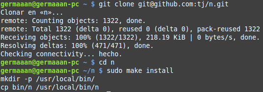
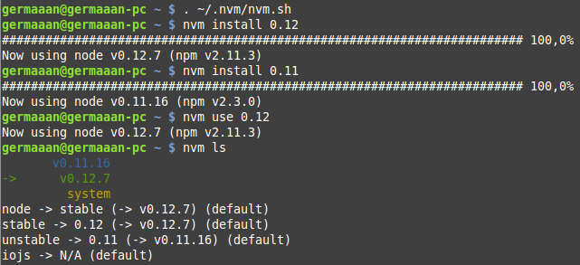

## Ejercicio 1

#### Instalar alguno de los entornos virtuales de `node.js` y, con ellos, instalar la última versión existente, la versión *minor* más actual de la 0.12 y lo mismo para la 0.11 o alguna impar. Si no se usa habitualmente este lenguaje, hacer lo mismo con cualquier otro lenguaje de scripting.

Voy a instalar el entorno virtual `nvm`:

```
curl -o- https://raw.githubusercontent.com/creationix/nvm/v0.29.0/install.sh | bash
```



Una vez instalado, lo primero que tenemos que hacer es activarlo:

```
. ~/.nvm/nvm.sh
```

Finalmente solo nos quedará instalar las versiones de `node.js` que queramos instalar, en este caso las versiones *0.12* y *0.11*. También podemos indicar que queremos usar por defecto la versión *0.12* y de paso listar todas las versiones que tenemos instaladas.

```
nvm install 0.12
nvm install 0.11
nvm use 0.12
nvm ls
```


